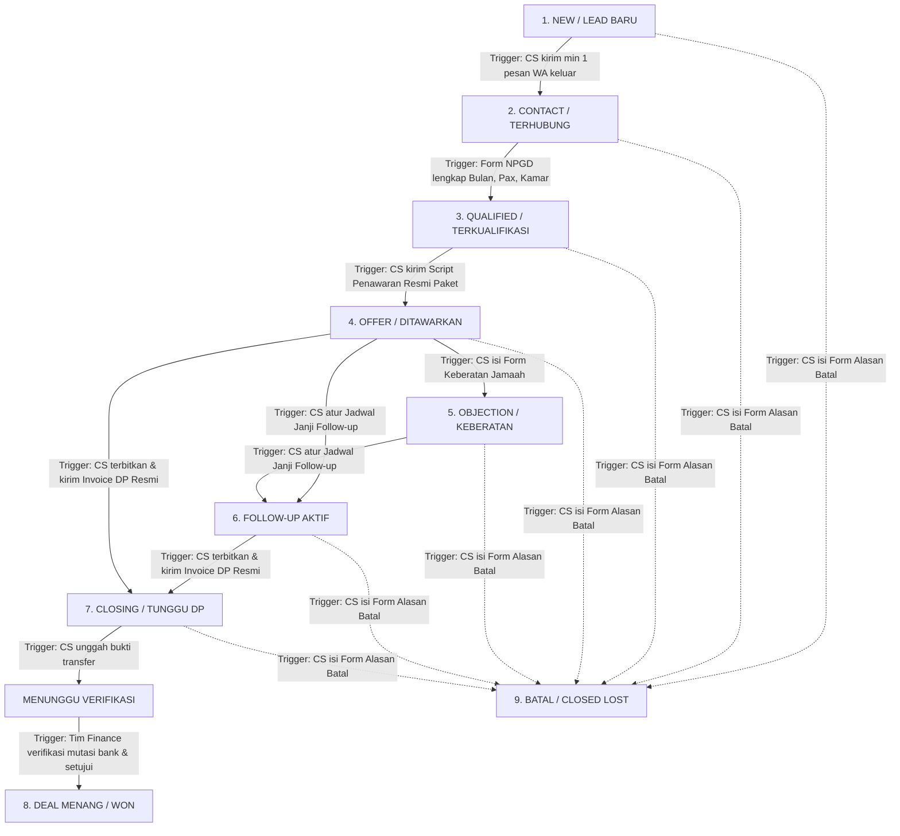

# Blueprint & Arsitektur Fitur Pipeline CRM Umroh
**Sistem**: CRM Azhan (CS Umroh — Conversion Desk)  
**Versi**: 2.0 (Action-Driven Pipeline Architecture)  
**Tanggal Update**: September 2026  
**Fokus**: Otomasi Konversi Penjualan High-Ticket Umroh Berbasis Aktivitas WhatsApp & Anti-Fraud Finance  

---

## 1. Ringkasan Eksekutif (Executive Summary)

Fitur **Pipeline CRM** di CRM Azhan beralih dari sekadar papan visual kanban manual menjadi **Action-Driven Pipeline State Engine**. Masalah terbesar CRM konvensional adalah keengganan Customer Service (CS) memperbarui status secara manual atau memindahkan kartu tanpa data yang valid.

Pada arsitektur baru ini, **perpindahan stage terjadi 100% otomatis** berbasis aksi nyata di lapangan (pengiriman pesan WA, pengisian form kualifikasi, penerbitan penawaran resmi, pembuatan invoice, dan verifikasi keuangan oleh tim Finance). CS dapat fokus melayani jamaah dan melakukan closing, sementara sistem CRM secara cerdas memperbarui status pipeline, menghitung nilai deal, dan menembakkan event Meta Conversions API (CAPI) secara presisi.

---

## 2. Karakteristik Unik Penjualan Umroh & Urgensi Otomasi

| Karakteristik | Realitas Lapangan Bisnis Umroh | Kebutuhan Solusi di Pipeline CRM |
|---|---|---|
| **High-Ticket Sales** | Nilai transaksi Rp 25 jt – Rp 60+ jt per pax (Keluarga: Rp 100 jt – Rp 250 jt). | Wajib kalkulasi potensi omzet riil per kolom berdasarkan kamar (Quad/Triple/Double) × Pax. |
| **Siklus Pertimbangan (5–30 Hari)** | Jamaah tidak membeli impulsif; butuh waktu musyawarah keluarga. | Wajib memiliki tahapan kualifikasi dan *follow-up cadence* otomatis agar prospek tidak hilang kontak. |
| **WhatsApp-First Conversion** | 90%+ percakapan, kirim brosur, dan bukti transfer terjadi di chat WA. | Pipeline harus terhubung erat secara dua arah dengan WhatsApp Live Chat. |
| **Sensitivitas Kuota & Waktu** | Tanggal keberangkatan riil, batas booking seat maskapai, dan batas rooming list hotel. | Diperlukan batas waktu (*due date*) invoice DP dan pengingat follow-up berbasis jam/hari. |
| **Pemisahan Penjualan & Keuangan** | Rawannya kesalahan rekap DP atau klaim komisi sepihak tanpa uang masuk riil. | **Segregation of Duties**: Hanya role **Finance** yang berhak menandai status "Deal (Won)" setelah cek mutasi bank. |

---

## 3. Diagram Alur & Kriteria Wajib Perpindahan Stage



---

## 4. Rincian Kriteria & Trigger Otomatis Tiap Stage

| No | Stage Asal ➔ Tujuan | Kriteria & Aksi Wajib Pemantik (Trigger) | Otomasi Sistem & Sinyal Meta CAPI |
|---|---|---|---|
| **1** | `new` ➔ `contact` | **CS mengirim minimal 1 pesan keluar** via WhatsApp (teks/media/template sapaan). | Status berubah ke `contact`. Menembakkan Meta CAPI: `Contact`. |
| **2** | `contact` ➔ `qualified` | **CS menyimpan Form Kualifikasi (NPGD)** dengan 3 data wajib terisi: <br>1. Rencana Bulan/Musim (`targetMonth`)<br>2. Jumlah Pax (`paxQuad + paxTriple + paxDouble + paxInfant > 0`)<br>3. Tipe Kamar idaman (`roomPreference`). | Status berubah ke `qualified`. Deal Value otomatis terkalkulasi. |
| **3** | `qualified` ➔ `offer` | **CS mengirim Naskah Penawaran Resmi (*Official Offer Script*)** yang memuat paket aktif, rincian biaya, maskapai, dan hotel. | Status berubah ke `offer`. Menembakkan Meta CAPI: `AddToCart`. |
| **4** | `offer` ➔ `objection` | **CS mengisi Form Keberatan** (memilih kategori keberatan: harga, kompetitor, cuti kerja, paspor, keluarga + catatan solusi). | Status berubah ke `objection`. Kartu diberi label keberatan. |
| **5** | Masuk ke `followup` | **CS menentukan Tanggal & Waktu Follow-up Berikutnya** (`nextFollowupDate`) + catatan janji follow-up. | Status berubah ke `followup`. Jadwal masuk ke kalender & reminder CS. |
| **6** | Masuk ke `closing` | **CS menerbitkan & mengirim Invoice DP Resmi** ke nomor WhatsApp calon jamaah. | Status berubah ke `closing`. Menembakkan Meta CAPI: `InitiateCheckout`. Seat di-hold sementara. |
| **7** | `closing` ➔ `deal` | **CS upload bukti bayar ➔ Role FINANCE memeriksa mutasi bank dan klik tombol "Verifikasi & Setujui"**. | Status berubah ke `deal`. Menembakkan Meta CAPI: `Purchase`. Kirim kwitansi resmi ke WA. |
| **8** | Menuju `lose` | **CS mengisi Form Pembatalan** (wajib memilih alasan batal: harga, travel lain, batal berangkat, ghosting + catatan). | Status berubah ke `lose`. Data diarsipkan untuk audit & retargeting. |

---

## 5. Analisa Fitur Turunan yang Perlu Disesuaikan atau Dibangun

Untuk mendukung 8 pilar otomasi di atas, berikut rincian fitur turunan yang perlu dibangun pada arsitektur CRM:

### A. Penyelarasan Enum Status & Schema Database
Pembaruan enum pada database (`schema.prisma` dan `@csumroh/shared-types`):
```prisma
enum ProspectStatus {
  new           // Prospek baru dari iklan/WA, belum ada sapaan keluar
  contact       // Sudah disapa / ada interaksi chat keluar
  qualified     // Kualifikasi NPGD terisi lengkap (Bulan, Pax, Kamar)
  offer         // Penawaran resmi paket sudah dikirimkan
  objection     // Mengalami keberatan spesifik
  followup      // Dalam jadwal follow-up berkala
  closing       // Invoice DP resmi telah terbit dan dikirim
  deal          // Deal sah, pembayaran diverifikasi Finance
  lose          // Batal dengan alasan terdokumentasi
  nurture       // Arsip prospek jangka panjang untuk musim berikutnya
}
```

---

### B. Modul Role Baru: `finance` (Segregation of Duties & Anti-Fraud)
* **Kebutuhan**: Penambahan role `finance` pada enum `Role`: `superadmin`, `admin`, `cs`, `finance`.
* **Hak Akses Khusus**:
  - **CS**: Hanya berhak mengunggah bukti transfer jamaah dan mengajukan permohonan verifikasi (*Submit Payment Proof*). CS **dilarang keras** memindahkan prospek ke `closed_won`.
  - **Finance & Admin**:
    - Memiliki menu khusus: **"Verifikasi Pembayaran"** (`/finance/verifications`).
    - Menampilkan antrean prospek berstatus `closing` yang sudah ada bukti transfer.
    - Form verifikasi: Input tanggal mutasi rekening koran, bank penerima (Mandiri PT Hana, BSI, dll), dan nominal riil yang masuk.
    - Tombol otoritas: **[ Setujui & Tandai Deal (Won) ]** atau **[ Tolak Bukti Transfer ]**.

---

### C. Backend Outbound Message Hook (`new` ➔ `contact`)
* **Lokasi**: Handler pengiriman pesan `/chat/send` di API.
* **Logika**:
  ```ts
  if (prospect.status === 'new' && isCsOutboundMessage) {
    await updateProspectStatus(prospect.id, 'contact');
    await dispatchCapiEvent(prospect.id, 'Contact');
  }
  ```
* **Dampak**: 100% otomatis tanpa klik tombol tambahan oleh CS.

---

### D. Profiling Auto-Validator (`contact` ➔ `qualified`)
* **Lokasi**: Panel Profil Prospek (*Prospect Profile Form*).
* **Logika**: Saat tombol "Simpan Profil" diklik:
  - Cek apakah `targetMonth`, total `pax` (> 0), dan `roomPreference` telah terisi.
  - Jika lengkap dan status saat ini adalah `contact`, sistem otomatis mempromosikan status ke `qualified`.
  - Tampilkan indikator visual di UI: *"Status otomatis naik ke: Terkualifikasi (Qualified)"*.

---

### E. Generator Naskah Penawaran Resmi (*Official Offer Builder*)
* **Fitur**: Tombol aksi di toolbar chat: **"📄 Kirim Penawaran Resmi"**.
* **Komponen**:
  - Modal pembuat penawaran yang mengambil data dinamis paket umroh aktif:
    * Pilihan paket & tanggal keberangkatan.
    * Rincian hotel Makkah & Madinah + maskapai penerbangan.
    * Rincian total deal (Pax × Harga kamar).
    * Fasilitas *free* (Kereta Cepat Haramain, Perlengkapan VIP, Handling Lounge).
  - Mengirimkan naskah terformat indah ke chat WhatsApp prospek.
  - Begitu terkirim, sistem otomatis menggeser status ke `offer` dan menembakkan Meta CAPI: `AddToCart`.

---

### F. Modal Catat Keberatan (*Objection Logger*)
* **Fitur**: Tombol **"⚠️ Catat Keberatan"** di Live Chat / Profil.
* **Input Wajib**:
  - Kategori Keberatan:
    1. *Harga dinilai terlalu mahal / di luar budget*
    2. *Bandingkan dengan travel kompetitor*
    3. *Kendala jadwal cuti / paspor belum siap*
    4. *Keluarga / pengambil keputusan belum sepakat*
    5. *Ragu fasilitas / jarak hotel ke masjid*
  - Solusi / counter-argumen yang telah disampaikan CS.
* **Efek**: Status otomatis berpindah ke `objection`.

---

### G. Scheduler Follow-Up Cerdas
* **Fitur**: Modal **"📅 Atur Jadwal Follow-up"**.
* **Input Wajib**:
  - Tanggal & jam rencana kontak kembali.
  - Catatan janji (misal: *"Hubungi setelah jam istirahat kantor untuk konfirmasi persetujuan suami"*).
* **Efek**:
  - Status otomatis pindah ke `followup`.
  - Kartu kanban memunculkan indikator waktu:
    - 🟢 Hijau: Jadwal masih beberapa hari ke depan.
    - 🟡 Kuning: Jadwal jatuh tempo **hari ini**.
    - 🔴 Merah: **Overdue** (terlambat di-follow-up).

---

### H. Generator Invoice DP Resmi
* **Fitur**: Tombol **"💳 Terbitkan & Kirim Invoice DP"**.
* **Fungsi**:
  - Menghasilkan nomor invoice resmi (contoh: `INV/2026/09/HA-0089`).
  - Menentukan nominal DP yang wajib disetor (contoh: Rp 5.000.000 / pax × 4 pax = Rp 20.000.000).
  - Menyertakan nomor rekening resmi PT/Biro dan batas waktu pelunasan DP (*Due Date* 1x24 jam untuk lock seat).
  - Mengirimkan pesan WhatsApp terstruktur dan tautan invoice digital.
  - Begitu dikirim, status otomatis beralih ke `closing / tunggu dp` (Meta CAPI: `InitiateCheckout`).

---

### I. Perilaku Drag & Drop di Kanban (Guided Action Modals)
Bagaimana jika CS menyeret kartu (*drag and drop*) secara manual di papan Kanban?
Sistem **tidak menolak secara kaku**, melainkan **membuka dialog pemenuhan syarat (*Guided Action*)**:

1. **Seret ke `qualified`**: Jika form kualifikasi belum lengkap, muncul pop-up untuk melengkapi data bulan, pax, dan tipe kamar.
2. **Seret ke `offer`**: Muncul modal untuk memilih paket dan mengirim naskah penawaran resmi.
3. **Seret ke `objection`**: Muncul modal form pencatatan keberatan.
4. **Seret ke `followup`**: Muncul modal pengisian tanggal & jam janji follow-up.
5. **Seret ke `closing`**: Muncul modal penerbitan invoice DP resmi.
6. **Seret ke `closed_lost`**: Muncul modal wajib memilih alasan pembatalan.
7. **Seret ke `closed_won`**:
   - Jika pengguna adalah CS: Muncul pesan informatif: *"Hanya tim Finance yang berhak memvalidasi pembayaran dan menandai Deal. Silakan upload bukti bayar untuk diverifikasi Finance."*
   - Jika pengguna adalah Finance: Membuka modal konfirmasi pencocokan mutasi bank.

---

## 6. Roadmap Implementasi Bertahap

```
┌────────────────────────────────────────────────────────────────────────┐
│                      ROADMAP PENGEMBANGAN 4 TAHAP                      │
├─────────────────┬─────────────────┬─────────────────┬──────────────────┤
│ TAHAP 1         │ TAHAP 2         │ TAHAP 3         │ TAHAP 4          │
│ Fondasi Schema  │ Generator       │ Generator       │ Otoritas Finance │
│ & Otomasi Awal  │ Penawaran &     │ Invoice DP &    │ & Guided Kanban  │
│                 │ Catat Keberatan │ Follow-up Guard │ Modals           │
├─────────────────┼─────────────────┼─────────────────┼──────────────────┤
│ • Enum Status   │ • Builder Offer │ • Invoice DP WA │ • Role Finance   │
│ • Role Finance  │ • Log Objection │ • Scheduler     │ • Verif Panel    │
│ • Auto Contact  │ • CAPI AddToCart│ • CAPI Checkout │ • Drag Modals    │
│ • Auto Qualified│                 │                 │ • CAPI Purchase  │
└─────────────────┴─────────────────┴─────────────────┴──────────────────┘
```

1. **Tahap 1: Fondasi Schema & Otomasi Awal**
   - Update Prisma schema (`Role` + `finance`, `ProspectStatus`).
   - Implementasi Hook pesan pertama (`new` ➔ `contact`).
   - Implementasi Validator Profil NPGD (`contact` ➔ `qualified`).
2. **Tahap 2: Generator Penawaran & Form Keberatan**
   - Bangun komponen naskah penawaran resmi WhatsApp (`qualified` ➔ `offer`).
   - Bangun modal pencatatan keberatan jamaah (`offer` ➔ `objection`).
3. **Tahap 3: Generator Invoice DP & Follow-up Scheduler**
   - Bangun pembuat invoice DP resmi berbatas waktu (`closing`).
   - Penjadwalan tanggal janji kontak + badge peringatan overdue (`followup`).
4. **Tahap 4: Otoritas Role Finance & Guided Kanban Modals**
   - Halaman Verifikasi Pembayaran khusus Finance (`closed_won`).
   - Konversi drag & drop manual menjadi *Guided Action Modals*.

---

## 7. Kesimpulan

Arsitektur **Action-Driven Pipeline** ini menghilangkan kelemahan utama CRM operasional: ketergantungan pada disiplin manual CS. Dengan mengikat setiap tahapan pada dokumen nyata (pesan, profil kualifikasi, penawaran harga, invoice, mutasi bank), biro umroh mendapatkan **pipeline yang 100% disiplin, bersih dari manipulasi, dan otomatis meningkatkan konversi penjualan**.
