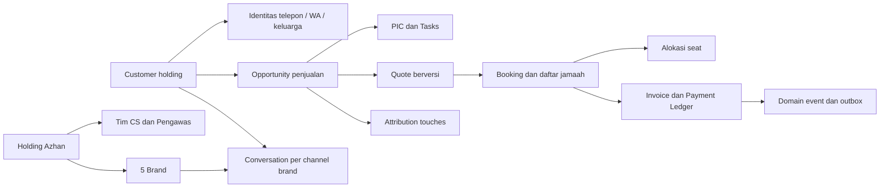

# Audit CRM Azhan — Operasional Holding dan Closing Jamaah

Tanggal: 23 September 2026. Dasar audit: kode workspace, termasuk perubahan yang belum di-commit, dokumentasi, tes lokal, pemeriksaan HTTP, dan agregat database lokal secara read-only.

## 1. Keputusan bisnis yang menjadi acuan

Azhan Grup adalah satu perusahaan/manajemen yang menaungi lima brand travel umroh. CS merupakan tim holding. Marketing dan growth holding harus dapat mengawasi keseluruhan perjalanan lead sampai booking dan pembayaran.

Konsekuensinya:

- Brand merupakan dimensi produk, kanal komunikasi, penawaran, dan atribusi; bukan tenant perusahaan pelanggan SaaS.
- Data pelanggan dan pengawasan sebaiknya terpusat. Hak melihat lintas brand adalah kebutuhan bisnis yang sah.
- Hak melihat, membalas, mengalihkan PIC, mengubah penawaran, menyetujui pembayaran, dan mengelola sistem harus dibedakan.
- Identitas pengirim WA, paket yang dijual, rekening penerima, dan brand transaksi harus tetap jelas meskipun pengawasannya terpusat.
- Tidak diperlukan fitur subscription, onboarding travel eksternal, billing SaaS, atau database terpisah per brand.

Penilaian: fondasi stack dapat dipertahankan. Kesenjangan terbesar terdapat pada model pelanggan/peluang, penugasan CS, tindak lanjut, konsistensi transaksi, serta pengukuran holding. Penambahan fitur visual tanpa memperbaiki hal tersebut berisiko mempercantik data yang belum dapat dipercaya.

## 2. Cakupan dan batas pembuktian

Ditelusuri: auth dan scope, router API, Prisma dan migrasi, pipeline, profil, katalog, kontak, distribusi prospek, shared inbox, gateway/history/media, Socket.io, Meta CAPI, frontend routing/cache/form, Copilot, LMS, serta tes yang tersedia.

Metode:

- Review kode dan penelusuran alur lintas frontend/API/gateway/database.
- HTTP GET web dan health API/gateway: ketiganya merespons 200.
- Browser: halaman login berhasil diamati; tidak tersedia sesi pengguna terautentikasi di browser audit. Alur setelah login ditelaah dari kode dan tes, bukan diklaim telah diuji end-to-end melalui UI.
- Database: hanya SELECT/count/groupBy. Tidak membaca isi percakapan, token, password, atau menyalin identitas jamaah ke laporan.
- Tes pada sesi ini: 22 tes lulus di 8 file. Typecheck web/shared-types/gateway lulus; API gagal pada dua assignment `string | undefined` di katalog upload flyer.
- pnpm mengalami kendala akses registry; tes/typecheck dijalankan melalui executable dependency lokal. Build produksi, load test, restore backup, dan deployment belum diuji.
- Tidak mengirim pesan WA, memicu event Meta, mengubah transaksi, atau menjalankan migrasi/seed/cleanup.

Temuan kode menunjukkan mekanisme dan risiko, bukan bukti bahwa insiden tersebut sudah terjadi. Perilaku Meta/Baileys terhadap akun aktual belum divalidasi lewat transaksi eksternal.

## 3. Snapshot database lokal

Angka berikut hanya menggambarkan database yang terhubung di workspace ini, bukan seluruh produksi Azhan Grup. Tidak semua hasil impor percakapan otomatis merupakan lead penjualan yang layak dihitung.

| Indikator | Hasil |
|---|---:|
| Brand yang tercatat | 2 dari kebutuhan bisnis 5 brand |
| Status sesi WA di database | 2 connected |
| Prospek | 56 |
| Pesan tersimpan | 4.776 |
| Prospek tanpa PIC | 46 |
| Prospek dengan PIC nonaktif | 8 |
| Prospek tanpa jadwal follow-up | 55 |
| Status new / contact / qualified / offer | 49 / 4 / 1 / 2 |
| Prospek new yang sudah memiliki pesan keluar | 45 |
| Prospek tanpa nomor telepon | 1 |
| Prospek memiliki penanda CTWA | 1 |
| Brand dengan empat field konfigurasi CAPI terisi | 0 |
| Log CAPI | 0 |
| Kelompok nomor sama di dalam satu brand | 0 berdasarkan nilai phone tersimpan |
| Kelompok nomor berulang antar-record | 2 berdasarkan nilai phone tersimpan |
| Pengguna | 2 superadmin aktif, 1 CS aktif, 1 CS nonaktif; belum ada admin/finance |

Interpretasi: kepemilikan dan tindak lanjut perlu diperiksa terlebih dahulu. Angka 45 tidak membuktikan 45 lead baru telah dihubungi tim saat ini: pesan dapat berasal dari history atau perangkat WA. Namun angka tersebut membuktikan status pipeline belum merepresentasikan riwayat pesan secara konsisten. Dua kelompok nomor berulang merupakan kandidat pencocokan identitas, bukan alasan untuk langsung menggabungkan transaksi.

Schema database lokal sudah memiliki enum baru dan kolom invoice/bukti bayar. Masalah migrasi di bawah adalah ketidaksesuaian artefak migrasi dengan schema tersebut, bukan klaim bahwa database lokal masih memakai enum lama.

## 4. Yang sudah menjadi fondasi baik

- React/Express/Prisma/TypeScript dalam monorepo cukup untuk kebutuhan holding; belum ada alasan untuk rewrite framework.
- Gateway WA dipisahkan dari API. Ada penyimpanan sesi, reconnect, sinkronisasi history, dan normalisasi LID/nomor.
- Access token berada di memory; refresh token memakai cookie httpOnly dan hash di database.
- Klaim PIC eksplisit menggunakan conditional update; event message memiliki unique key per brand/messageId.
- Referral CTWA pertama dilindungi conditional update. Token Meta menggunakan AES-GCM dan nomor untuk payload Meta di-hash.
- Terdapat audit log prospek, komponen UI reusable, kalkulasi bersama, dan tes dasar.

Fondasi tersebut perlu diperluas ke semua jalur mutasi, bukan dibuang.

## 5. Temuan berprioritas dan tindakan korektif

P1: ditangani sebelum perluasan penggunaan lima brand atau sebelum alur terkait dipercaya untuk transaksi. P2: perbaikan operasional berikutnya. Urutan dalam kelompok mengikuti dampak bisnis dan ketergantungan teknis.

### A01 — P1 — Pemilihan media dapat membaca file di luar area upload

**Bukti:** endpoint media menerima `existingFilePath`, kemudian mencoba path relatif terhadap direktori API, upload, dan root proyek. Tidak ada pemeriksaan bahwa resolved path tetap berada di root media yang diizinkan. File yang ditemukan dibaca dan diteruskan ke gateway. Lihat [chat.routes.ts:650](C:/laragon/www/crm-azhan/apps/api/src/modules/chat/chat.routes.ts:650), khususnya resolver mulai sekitar baris 695.

**Dampak:** pengguna dengan hak kirim media dapat meminta file server di luar katalog upload. Ini adalah batas akses file internal yang salah, terlepas dari konteks satu holding. Belum dilakukan eksploitasi atau pengiriman file.

**Perbaikan:** client hanya mengirim `attachmentId` atau `packageId`. Backend mengambil metadata file yang sah, memvalidasi izin dan realpath di direktori upload, lalu menolak file lain. Jangan menerima path filesystem arbitrer. Uji penolakan path absolut, traversal, symlink, dan file yang bukan attachment.

### A02 — P1 — Penawaran/invoice dinyatakan terkirim sebelum WA terkirim

**Bukti:** `/offer` dan `/invoice` mengubah status, mencatat waktu, dan memicu CAPI tanpa memanggil pengiriman WA. Modal frontend hanya memasukkan teks ke composer setelah API sukses. Di pipeline, callback memasukkan teks bahkan bersifat opsional. Lihat [prospects.routes.ts:267](C:/laragon/www/crm-azhan/apps/api/src/modules/prospects/prospects.routes.ts:267), [prospects.routes.ts:392](C:/laragon/www/crm-azhan/apps/api/src/modules/prospects/prospects.routes.ts:392), [OfficialOfferModal.tsx:94](C:/laragon/www/crm-azhan/apps/web/src/features/chat/OfficialOfferModal.tsx:94), dan [OfficialInvoiceModal.tsx:149](C:/laragon/www/crm-azhan/apps/web/src/features/chat/OfficialInvoiceModal.tsx:149).

**Dampak:** funnel dan sinyal iklan dapat menyatakan penawaran/checkout yang belum diterima jamaah; CS mengira tugas selesai.

**Perbaikan:** pisahkan draft, approved/issued, queued, sent, delivered, failed. Simpan snapshot penawaran/invoice dan job pengiriman dalam satu transaksi. Naikkan stage berbasis event pengiriman yang disepakati, dengan messageId sebagai bukti. UI membedakan “Simpan draft”, “Terbitkan”, dan “Kirim”. Status sent tidak boleh disamakan dengan delivered atau respons jamaah.

### A03 — P1 — Rekening, harga fallback, dan benefit belum bersumber dari data resmi

**Bukti:** rekening invoice berasal dari konstanta frontend; penawaran memiliki fallback harga Rp30 juta serta benefit tetap seperti Haramain, VIP, dan lounge. Skrip API juga mengisi klaim seat, promo, deadline, hotel, direct flight, dan PPIU menggunakan fallback yang belum tentu sesuai paket/brand. Lihat [OfficialInvoiceModal.tsx:24](C:/laragon/www/crm-azhan/apps/web/src/features/chat/OfficialInvoiceModal.tsx:24), [OfficialOfferModal.tsx:48](C:/laragon/www/crm-azhan/apps/web/src/features/chat/OfficialOfferModal.tsx:48), [scripts.routes.ts:129](C:/laragon/www/crm-azhan/apps/api/src/modules/scripts/scripts.routes.ts:129).

**Dampak:** nominal, rekening, atau janji fasilitas yang salah langsung mengancam kepercayaan dan closing. Satu holding boleh memakai rekening bersama, tetapi keputusan itu harus menjadi konfigurasi resmi.

**Perbaikan:** katalog rekening resmi holding dengan mapping brand; harga numerik tervalidasi; benefit dan promo dari paket aktif; snapshot pada dokumen. Jika data kritis belum lengkap, blokir penerbitan atau tampilkan perlu konfirmasi. Jangan menghasilkan klaim kelangkaan atau fasilitas rekaan. Uji perubahan harga setelah penawaran tidak mengubah snapshot lama.

### A04 — P1 — Otoritas keuangan dapat dilewati lewat edit profil

**Bukti:** endpoint profile mengizinkan `dpAmount`, `dpPaidAt`, `paymentStatus`, dan `dealValue` dari request untuk semua role yang lolos auth/scope; tanpa schema field yang kuat maupun pemeriksaan kewenangan keuangan. Verifikasi pembayaran membatasi role, tetapi jalur profil tetap terbuka. Lihat [prospects.routes.ts:214](C:/laragon/www/crm-azhan/apps/api/src/modules/prospects/prospects.routes.ts:214).

**Dampak:** nilai pembayaran/profil dapat tidak konsisten dengan verifikasi finance meskipun CS tidak dapat langsung menekan tombol Deal.

**Perbaikan:** pisahkan profile, quotation, dan payment commands. Backend menghitung nominal penawaran dari line item resmi. Perubahan catatan keuangan hanya melalui workflow finance dengan identitas aktor dan alasan. Kunci nilai transaksi yang sudah disahkan; koreksi melalui revision/reversal, bukan overwrite bebas.

### A05 — P1 — Verifikasi, kuota, dan booking belum aman terhadap pengulangan

**Bukti:** `isNewWin` ditentukan sebelum transaksi; verifikasi selalu mengatur `partial_dp`; setiap kemenangan mengurangi kuota hanya 1 meskipun pax lebih dari 1. Kuota 0 tidak menggagalkan perubahan Deal. Tidak ada ledger pembayaran/booking/reservasi, pemeriksaan bukti atau invoice sebagai prasyarat wajib, dan kunci idempotensi. `verifiedByUserId` lama memungkinkan validasi ulang melalui jalur status setelah reopen. Lihat [prospects.routes.ts:106](C:/laragon/www/crm-azhan/apps/api/src/modules/prospects/prospects.routes.ts:106), [prospects.routes.ts:468](C:/laragon/www/crm-azhan/apps/api/src/modules/prospects/prospects.routes.ts:468), [schema.prisma:150](C:/laragon/www/crm-azhan/apps/api/prisma/schema.prisma:150).

**Dampak:** dua approval bersamaan berpotensi menghitung kemenangan/kuota dua kali; satu keluarga dapat hanya memotong satu seat; pembayaran penuh tetap tampil DP; reopen dapat menimbulkan Purchase baru tanpa booking baru.

**Perbaikan:** booking sebagai objek tersendiri, pembayaran berbaris dengan referensi mutasi unik, idempotency key, conditional update/version dalam transaksi. Kuota mengikuti jumlah seat yang memang dikonsumsi sesuai kebijakan infant. Tangani hold, expiry, release, pembatalan, refund, dan sold-out secara eksplisit. Approval manual tanpa bukti digital boleh menjadi pengecualian terkontrol, bukan default diam-diam. Pendekatan transaksi/idempotensi/OCC dapat memakai Prisma yang sudah ada, sebagaimana dijelaskan [dokumentasi transaksi Prisma](https://www.prisma.io/docs/orm/v6/prisma-client/queries/transactions).

### A06 — P1 — Upload bukti bayar belum memiliki penyimpanan file yang tepat

**Bukti:** FileReader mengubah gambar menjadi data URL lalu menyimpannya melalui `paymentProofUrl`, yang merupakan kolom MySQL TEXT; tidak ada pipeline upload bukti khusus. Lihat [PaymentProofModal.tsx:29](C:/laragon/www/crm-azhan/apps/web/src/features/chat/PaymentProofModal.tsx:29), [schema.prisma:193](C:/laragon/www/crm-azhan/apps/api/prisma/schema.prisma:193).

**Dampak:** gambar biasa dapat melampaui kapasitas kolom, payload profil membengkak, dan bukti tidak mempunyai metadata/riwayat terstruktur.

**Perbaikan:** file disimpan di storage privat; database menyimpan attachmentId, mime hasil deteksi, ukuran, hash, pengunggah, waktu, dan paymentSubmissionId. Batasi ukuran dan jenis file, beri preview dan status unggah, lalu akses melalui endpoint berizin. Hindari memasukkan bukti transaksi ke static public uploads.

### A07 — P1 — Tim CS holding belum didukung oleh model hak akses yang konsisten

**Bukti:** UserBrand sudah ada, tetapi auth scope, hook frontend, socket room, distribusi, dan pembacaan katalog dominan memakai satu `User.brandId`. Manajemen staf menerima admin/cs, belum finance. Route UI banyak memakai cek “bukan cs” sementara API membatasi admin/superadmin. Lihat [auth.ts](C:/laragon/www/crm-azhan/apps/api/src/middleware/auth.ts), [scope.ts](C:/laragon/www/crm-azhan/apps/web/src/lib/scope.ts), [socket.ts](C:/laragon/www/crm-azhan/apps/api/src/realtime/socket.ts), [catalog.routes.ts:396](C:/laragon/www/crm-azhan/apps/api/src/modules/catalog/catalog.routes.ts:396), [App.tsx](C:/laragon/www/crm-azhan/apps/web/src/app/App.tsx).

**Dampak:** staf tampak ditugaskan ke beberapa brand tetapi alur operasionalnya masih terikat brand utama; growth perlu superadmin untuk akses lintas brand dan ikut memperoleh hak destruktif yang tidak diperlukan.

**Perbaikan:** central authorization policy dengan capability, cakupan holding/tim, dan brand assignment. Pisahkan hak read, reply, assign, verify, edit catalog, dan manage system. Perbolehkan akses lintas brand secara eksplisit sesuai peran. Jangan sekadar menghapus semua brand guard; validasi konsistensi paket, channel, invoice, dan rekening tetap diperlukan.

### A08 — P1 — Penugasan dan handover membuat lead mudah terlantar

**Bukti:** distribusi hanya memilih CS aktif berdasarkan brand utama dan jumlah prospek yang mengecualikan status closed_won/closed_lost lama; deal/lose baru masih dihitung aktif. Akun yang dinonaktifkan tidak memicu handover. Klaim eksplisit conditional, tetapi auto-claim saat mengirim menggunakan hasil baca lama dan update tanpa kondisi. Lihat [chat.routes.ts:578](C:/laragon/www/crm-azhan/apps/api/src/modules/chat/chat.routes.ts:578), [chat.routes.ts:1158](C:/laragon/www/crm-azhan/apps/api/src/modules/chat/chat.routes.ts:1158), [catalog.routes.ts:492](C:/laragon/www/crm-azhan/apps/api/src/modules/catalog/catalog.routes.ts:492).

**Dampak:** 46 prospek lokal tanpa PIC dan 8 dengan PIC nonaktif belum mempunyai jaring pengaman. Dua CS dapat membalas prospek belum diklaim sebelum salah satunya menang kepemilikan.

**Perbaikan:** antrean unassigned pusat, assignment atomik sebelum kirim, jam kerja/availability/capacity, status aktif kanonis, supervisor handover dan backup PIC. Nonaktifkan staf harus menghasilkan daftar pekerjaan untuk dialihkan. Simpan riwayat assignment dan alasan; jangan otomatis memindahkan PIC hanya karena supervisor membantu membalas.

### A09 — P1 — Belum ada sistem next action dan eskalasi follow-up

**Bukti:** hanya satu `nextFollowupDate` bertipe DATE. Endpoint activities mencatat aktivitas, tetapi lastFollowupAt hanya diperbarui jika tanggal berikutnya diberikan; tanggal opsional dan belum ada reminder worker. Permintaan follow-up dari pipeline tidak menyertakan brandId bagi superadmin. Lihat [prospects.routes.ts:352](C:/laragon/www/crm-azhan/apps/api/src/modules/prospects/prospects.routes.ts:352), [PipelinePage.tsx:143](C:/laragon/www/crm-azhan/apps/web/src/features/prospects/PipelinePage.tsx:143), [schema.prisma:195](C:/laragon/www/crm-azhan/apps/api/prisma/schema.prisma:195).

**Dampak:** jadwal jam hilang, follow-up dapat tersimpan tanpa tugas berikutnya, holding tidak memiliki antrean keterlambatan yang bisa ditindaklanjuti. Snapshot lokal: 55/56 tanpa jadwal.

**Perbaikan:** Task terpisah dengan dueAt, timezone, owner, type, status, completedAt, outcome, snooze reason, dan escalationAt. Setiap opportunity aktif mempunyai PIC dan next action, atau alasan pengecualian. Halaman “Tugas Saya” memprioritaskan inbound belum dibalas, overdue, janji hari ini, penawaran belum ditindaklanjuti, dan invoice mendekati jatuh tempo. Reminder internal dahulu; otomatis mengirim WA hanya setelah aturan dan persetujuan operasional ditetapkan.

### A10 — P1 — Riwayat CRM bergantung pada koneksi perangkat WA

**Bukti:** API pesan mengembalikan array kosong ketika session tidak connected; frontend menyembunyikan daftar dan menonaktifkan query pesan. Daftar pipeline/dashboard hanya mengambil prospek dengan pesan yang memenuhi filter livechat. Lihat [chat.routes.ts:131](C:/laragon/www/crm-azhan/apps/api/src/modules/chat/chat.routes.ts:131), [chat.routes.ts:344](C:/laragon/www/crm-azhan/apps/api/src/modules/chat/chat.routes.ts:344), [prospects.routes.ts:30](C:/laragon/www/crm-azhan/apps/api/src/modules/prospects/prospects.routes.ts:30), [InboxPage.tsx:392](C:/laragon/www/crm-azhan/apps/web/src/features/chat/InboxPage.tsx:392).

**Dampak:** ketika WA putus, CS kehilangan akses kerja terhadap history yang sebenarnya tersimpan. Lead telepon, walk-in, referral, atau form berpotensi tidak masuk papan penjualan.

**Perbaikan:** CRM membaca database tanpa syarat WA online. Status perangkat hanya menentukan kemampuan send/sync. Intake lead mempunyai sumber dan status sales_eligible; percakapan operasional/vendor/spam tidak otomatis menjadi denominator closing. Query pipeline harus berasal dari opportunity, bukan daftar chat.

### A11 — P1 — API/gateway belum menjamin rekonsiliasi pesan

**Bukti:** pesan keluar dikirim ke WA sebelum disimpan dengan `chatMessage.create`; ingestion echo/history memakai upsert pada unique messageId. Echo dapat mendahului create. Gateway notify mencatat error tanpa retry persisten. Update receipt sebelum row pesan dibuat dapat menghasilkan updated=0 tanpa replay. Lihat [chat.routes.ts:557](C:/laragon/www/crm-azhan/apps/api/src/modules/chat/chat.routes.ts:557), [chat.routes.ts:1199](C:/laragon/www/crm-azhan/apps/api/src/modules/chat/chat.routes.ts:1199), [chat.routes.ts:1236](C:/laragon/www/crm-azhan/apps/api/src/modules/chat/chat.routes.ts:1236), [wa-gateway/server.ts:37](C:/laragon/www/crm-azhan/apps/wa-gateway/src/server.ts:37).

**Dampak:** pesan sudah terkirim tetapi UI menampilkan gagal; retry manual bisa menggandakan pesan. Inbound atau receipt dapat terlewat saat API down. Tidak diklaim semua kejadian tersebut sudah terjadi.

**Perbaikan:** outbound command dengan clientRequestId unik, penyimpanan intent sebelum send, status unknown untuk timeout ambigu, rekonsiliasi provider messageId, serta merge echo yang idempoten. Gateway menyimpan event masuk sampai API acknowledge; retry dengan backoff dan dead-letter untuk investigasi. Jangan menjanjikan exactly-once delivery ke WA tanpa dukungan provider; lindungi command lokal dan rekonsiliasi hasil.

### A12 — P1 — Sesi real-time bisa memakai token lama dan kehilangan pembaruan

**Bukti:** SocketBridge memasang token sekali berdasarkan user, sedangkan refresh HTTP hanya mengubah variabel accessToken. Tidak ada refresh socket auth, recovery cursor, atau resync saat connect. Backend memeriksa JWT pada handshake saja. Akun nonaktif/perubahan role/logout tidak memutus socket yang sudah terhubung. Lihat [socket.tsx](C:/laragon/www/crm-azhan/apps/web/src/app/socket.tsx), [api.ts](C:/laragon/www/crm-azhan/apps/web/src/lib/api.ts), [realtime/socket.ts](C:/laragon/www/crm-azhan/apps/api/src/realtime/socket.ts), [auth.routes.ts](C:/laragon/www/crm-azhan/apps/api/src/modules/auth/auth.routes.ts).

**Dampak:** reconnect setelah access token kedaluwarsa bisa gagal; UI tampak tenang padahal tidak menerima pesan baru. Hak lama dapat bertahan pada socket aktif. Logout juga belum membersihkan QueryClient/store, sehingga sesi berikutnya dapat melihat cache lama sementara.

**Perbaikan:** satu refresh promise untuk request paralel, rotasi token atomik, sinkronisasi socket auth, resync query saat reconnect, indikator koneksi aktual, session version/revocation dan disconnect saat perubahan hak. Bersihkan cache dan state saat logout. Socket.io secara default tidak memutar ulang event server yang terlewat; aplikasi perlu recovery sendiri. [Dokumentasi delivery guarantees Socket.io](https://socket.io/docs/v4/delivery-guarantees/).

### A13 — P1 — CAPI belum layak menjadi sumber optimasi tanpa hardening

**Bukti:** dispatch hanya async dalam proses; tidak ada durable queue. eventTime menggunakan updatedAt prospek, nilai Purchase dapat fallback dari harga paket umum × semua pax, dan Purchase ID memakai penghitung kemenangan prospek. Contact dipicu saat referral masuk serta kontak pertama dengan dedup eventId yang sama. Tombol test-event dapat mengirim payload sintetis tanpa testEventCode. Lihat [capi.service.ts](C:/laragon/www/crm-azhan/apps/api/src/modules/capi/capi.service.ts), [capi.payload.ts](C:/laragon/www/crm-azhan/apps/api/src/modules/capi/capi.payload.ts), [capi.routes.ts:135](C:/laragon/www/crm-azhan/apps/api/src/modules/capi/capi.routes.ts:135).

**Dampak:** restart dapat menggagalkan pengiriman; pengulangan status dapat membentuk Purchase semu; revenue event dapat berbeda dari harga final; pengujian berpotensi masuk dataset produksi. Lokal: konfigurasi empat field belum lengkap pada kedua brand dan belum ada log pengiriman.

**Perbaikan:** event dari transaksi domain immutable, eventTime waktu kejadian, value dari snapshot booking yang disetujui, eventId dari booking/event bisnis, outbox persisten dan retry status-aware. Wajib test code untuk payload sintetis. Bedakan attribution touch, source brand, selling brand, dan booking owner; jangan menyalin click ID ke semua dataset. Tentukan definisi Purchase yang konsisten antara growth dan finance lalu validasi payload/versi API dengan Meta pada akun nyata sebelum produksi.

### A14 — P1 — Dashboard belum memenuhi pengawasan holding

**Bukti:** dashboard membutuhkan satu brandId; perhitungan won/total menggunakan snapshot percakapan dan seluruh status. Frontend menjumlahkan nilai semua status sebagai estimasi pipeline aktif, termasuk deal/lose. Tidak ada filter cohort/periode atau metrik pax/pembayaran/SLA. Lihat [dashboard.routes.ts](C:/laragon/www/crm-azhan/apps/api/src/modules/dashboard/dashboard.routes.ts), [DashboardPage.tsx:19](C:/laragon/www/crm-azhan/apps/web/src/features/dashboard/DashboardPage.tsx:19).

**Dampak:** pimpinan belum bisa melihat lima brand sekaligus, membedakan closing keluarga vs pax, menemukan bottleneck, atau membandingkan hasil kampanye secara adil.

**Perbaikan:** dashboard holding default semua brand dengan drill-down brand/team/CS/cohort/package/departure/campaign. Pisahkan lead unik, opportunity, booking, pax, booking value, verified cash, outstanding, cancellation. Sediakan antrean tindakan yang bisa diklik, bukan hanya kartu angka.

### A15 — P2 — Pelanggan, percakapan, dan peluang penjualan masih menyatu

**Bukti:** satu Prospect menyimpan identitas, status, paket, invoice, pembayaran, dan pesan. Dedup memilih canonical prospect saat read berdasarkan skor; belum ada Customer global maupun Opportunity/Booking terpisah. Lihat [schema.prisma:150](C:/laragon/www/crm-azhan/apps/api/prisma/schema.prisma:150), [chat.routes.ts:100](C:/laragon/www/crm-azhan/apps/api/src/modules/chat/chat.routes.ts:100).

**Dampak:** repeat booking, satu keluarga, alternatif paket lintas brand, dan peralihan channel sulit dicatat tanpa menimpa data atau menggandakan pelanggan. Deduplikasi visual dapat menutupi beberapa state bisnis yang berbeda.

**Perbaikan:** Customer holding → identitas/channel → Conversation; Customer → Opportunity → Quote/Booking. Satu nomor dapat mewakili keluarga/pengambil keputusan; jangan otomatis menggabungkan jamaah perorangan hanya berdasarkan nomor. Suspected duplicate harus melalui review, dengan merge history dan undo mapping. Nomor/JID mempunyai unique identity per channel yang cocok; kesempatan membeli tetap dapat lebih dari satu.

### A16 — P2 — Definisi stage dan kompatibilitas legacy belum konsisten

**Bukti:** `canTransitionStatus` selalu true; sebagian syarat berada di route status, sedangkan action routes dapat mengubah stage tanpa state guard bersama. Legacy status diterima backend tetapi Kanban mencocokkan hanya status utama secara literal. Ingestion history/outbound dari perangkat tidak menjalankan aturan contact yang sama dengan pengiriman dari CRM. Lihat [business.ts:3](C:/laragon/www/crm-azhan/packages/shared-types/src/business.ts:3), [PipelinePage.tsx:403](C:/laragon/www/crm-azhan/apps/web/src/features/prospects/PipelinePage.tsx:403), [prospects.routes.ts](C:/laragon/www/crm-azhan/apps/api/src/modules/prospects/prospects.routes.ts), [chat.routes.ts:1089](C:/laragon/www/crm-azhan/apps/api/src/modules/chat/chat.routes.ts:1089).

**Perbaikan:** satu transition service untuk action dan manual override, optimistic version, stage history terstruktur dan alasan override. Alias legacy dipetakan saat read/migrasi terkontrol; nurture tetap dipertahankan. Bedakan backfill riwayat dengan event penjualan baru agar impor tidak menembakkan konversi massal. Follow-up dan objection sebaiknya juga menjadi task/atribut yang dapat hidup di beberapa stage, bukan menghapus informasi kemajuan penjualan.

### A17 — P2 — Beberapa integrasi frontend/backend salah sambung

**Bukti:** PipelinePage mengambil `/packages` sementara backend `/catalog/packages`; follow-up superadmin tidak membawa brandId; event `finance:payment_proof_new` dan `package:quota_updated` tidak ditangani SocketBridge; beberapa kegagalan kirim memakai `whatsapp:status` tetapi listener menggunakan `wa:status`. UI mengklaim notifikasi finance terkirim meski tidak ada tampilan antrean verifikasi khusus. Lihat [PipelinePage.tsx:98](C:/laragon/www/crm-azhan/apps/web/src/features/prospects/PipelinePage.tsx:98), [socket.tsx](C:/laragon/www/crm-azhan/apps/web/src/app/socket.tsx), [prospects.routes.ts:463](C:/laragon/www/crm-azhan/apps/api/src/modules/prospects/prospects.routes.ts:463), [chat.routes.ts:570](C:/laragon/www/crm-azhan/apps/api/src/modules/chat/chat.routes.ts:570).

**Perbaikan:** typed API client, shared event contracts, integration test per role. UI harus menyatakan hasil aktual; finance perlu antrean durable, bukan bergantung notifikasi sesaat.

### A18 — P2 — Pengalaman input rawan kehilangan konteks

**Bukti:** form profil direset lewat effect setiap query p berubah; event pesan menginvalidasi seluruh query prospect sehingga refetch bisa menimpa edit lokal. Timeline selalu scroll ke bawah saat messages.data berubah. Modal baru memakai div manual dengan pola fokus berbeda dari Radix dialog yang telah tersedia. Invoice mengisi datetime-local dari ISO UTC tetapi menampilkan WIB. Lihat [ChatProspectProfile.tsx:133](C:/laragon/www/crm-azhan/apps/web/src/features/chat/ChatProspectProfile.tsx:133), [InboxPage.tsx:406](C:/laragon/www/crm-azhan/apps/web/src/features/chat/InboxPage.tsx:406), [OfficialInvoiceModal.tsx:66](C:/laragon/www/crm-azhan/apps/web/src/features/chat/OfficialInvoiceModal.tsx:66).

**Perbaikan:** dirty-state protection dan version conflict, notifikasi data berubah tanpa reset diam-diam, autoscroll hanya ketika dekat bagian bawah, dialog standar keyboard/focus, timezone Asia/Jakarta konsisten. Uji split-screen sekitar 700 px, keyboard, refresh, dan dua CS bersamaan. Audit visual halaman terautentikasi masih perlu dilakukan.

### A19 — P2 — Query dan invalidasi terlalu luas untuk volume holding

**Bukti:** daftar percakapan mengambil semua prospek dan hingga 20 pesan per prospek; endpoint messages mengambil seluruh history; kontak menghitung semua brand/perangkat; berbagai event membatalkan hampir seluruh query. Lihat [chat.routes.ts:131](C:/laragon/www/crm-azhan/apps/api/src/modules/chat/chat.routes.ts:131), [chat.routes.ts:344](C:/laragon/www/crm-azhan/apps/api/src/modules/chat/chat.routes.ts:344), [contacts.routes.ts:100](C:/laragon/www/crm-azhan/apps/api/src/modules/contacts/contacts.routes.ts:100), [socket.tsx](C:/laragon/www/crm-azhan/apps/web/src/app/socket.tsx).

**Perbaikan:** pagination/cursor pesan dan inbox, ringkasan lastMessage/unread per conversation, agregasi dashboard di database, pencarian/filter server-side, patch cache berdasarkan id+brand dan debounce event bursts. Optimasi berdasarkan pengukuran query/latency; belum ada load test untuk menyatakan kapasitas maksimum.

### A20 — P1 — File upload publik dan validasi isi belum memadai

**Bukti:** `/uploads` disajikan statis tanpa auth; flyer menerima ekstensi dari data URL tanpa validasi isi; media mengambil ekstensi client. Media chat dapat memuat bukti transfer atau dokumen pribadi walaupun fitur upload bukti khusus belum benar. Lihat [server.ts:27](C:/laragon/www/crm-azhan/apps/api/src/server.ts:27), [catalog.routes.ts:226](C:/laragon/www/crm-azhan/apps/api/src/modules/catalog/catalog.routes.ts:226), [chat.routes.ts:751](C:/laragon/www/crm-azhan/apps/api/src/modules/chat/chat.routes.ts:751).

**Perbaikan:** pisahkan flyer publik dan attachment privat; MIME berdasarkan signature/decoder, ukuran, nama internal, izin download, serta retention. Ini pembatasan akses dokumen internal holding, bukan isolasi SaaS. Prinsip validasi berlapis dan penyimpanan aman sesuai [OWASP File Upload Cheat Sheet](https://cheatsheetseries.owasp.org/cheatsheets/File_Upload_Cheat_Sheet.html).

### A21 — P2 — Penghapusan master dapat menghilangkan jejak operasional

**Bukti:** delete brand memanggil hard delete; schema cascade ke paket/prospek/chat/CAPI dan log terkait. Hapus paket memutus relasi pada prospek. Log aktor user dapat menjadi null setelah user dihapus. Lihat [catalog.routes.ts:104](C:/laragon/www/crm-azhan/apps/api/src/modules/catalog/catalog.routes.ts:104), [schema.prisma](C:/laragon/www/crm-azhan/apps/api/prisma/schema.prisma).

**Perbaikan:** archive brand/package/staff, simpan snapshot transaksi dan aktor audit, batasi purge khusus data nonoperasional dengan retention yang disepakati. Brand holding yang berhenti dijual tetap dibutuhkan untuk laporan historis.

### A22 — P1 — Migrasi dan verifikasi belum mengunci perubahan bisnis terbaru

**Bukti:** hanya migrasi init yang masih memuat role/status lama, sementara schema dan DB lokal sudah lebih baru. API typecheck gagal pada baris 238–239 upload flyer. Tes yang ada dominan helper/payload/navigation, belum route transaksi, role matrix, race condition, atau recovery gateway. Tes status justru memastikan pergerakan bebas. Lihat [migration.sql](C:/laragon/www/crm-azhan/apps/api/prisma/migrations/20260921074239_init/migration.sql), [catalog.routes.ts:238](C:/laragon/www/crm-azhan/apps/api/src/modules/catalog/catalog.routes.ts:238), [business.test.ts](C:/laragon/www/crm-azhan/packages/shared-types/src/business.test.ts).

**Perbaikan:** selesaikan typecheck; inventarisasi schema aktual dan baseline migrasi sebelum membuat migrasi tambahan; uji instalasi baru dan upgrade salinan data. Tambahkan CI typecheck/test/build, pengujian route dengan database terisolasi, concurrency, dan satu alur E2E per peran. Jangan menjalankan db push/cleanup pada data operasional sebagai pengganti strategi migrasi.

### A23 — P2 — Observabilitas dan pemulihan belum lengkap

**Bukti:** health endpoint terutama mengembalikan status proses; gateway notify bisa gagal hanya dengan warning; belum ditemukan workflow backup/restore, readiness dependency, correlation ID, alarm backlog, atau graceful shutdown pada entrypoint yang ditelaah.

**Perbaikan:** readiness DB/gateway/worker terpisah dari liveness, logging terstruktur tanpa data sensitif, message correlation ID, alarm koneksi hilang dan job tertahan, backup DB/media/session yang terlindungi, serta uji restore. Tetapkan pemilik penanganan ketika kanal salah satu brand terputus. Lokasi runtime media bergantung working directory dan folder sibling API: deployment perlu shared persistent storage yang eksplisit.

### A24 — P2 — LMS dan coaching belum terhubung dengan kinerja tim

**Bukti:** progres LMS memakai satu key localStorage browser, tidak tersimpan per user di server. Copilot menyajikan template tanpa outcome tracking. Lihat [LmsPage.tsx:9](C:/laragon/www/crm-azhan/apps/web/src/features/lms/LmsPage.tsx:9), [ChatCopilotPanel.tsx](C:/laragon/www/crm-azhan/apps/web/src/features/chat/ChatCopilotPanel.tsx).

**Perbaikan:** progres per staf, coaching review oleh supervisor, versioning skrip, objection taxonomy, dan outcome penawaran. Ukur efektivitas template dengan konteks lead yang sebanding; jangan menyamakan banyak pesan dengan produktivitas atau mengasumsikan template menyebabkan konversi tanpa evaluasi.

## 6. Model operasional yang direkomendasikan

### Peran dan kewenangan

| Peran | Cakupan lihat | Tindakan utama | Pembatasan |
|---|---|---|---|
| System admin | Holding | Pengguna, konfigurasi, perangkat | Bukan akun harian semua pengawas |
| Marketing & growth | Semua brand, agregat dan drill-down sesuai izin | Funnel, atribusi, biaya kampanye, mutu lead, ekspor terkontrol | Tidak otomatis boleh validasi uang atau menghapus master |
| CS supervisor | Semua tim/brand yang diawasi | Assignment, handover, SLA, coaching, bantuan balas dengan audit | Approval keuangan harus capability terpisah |
| CS holding | Identitas/riwayat relevan dan antrean penugasan lintas brand | Tangani opportunity/PIC, profil, quote, tugas, pengajuan bukti | Tidak mengesahkan pembayaran sendiri |
| Finance | Booking dan pembayaran lintas brand | Verifikasi, penolakan beralasan, receipt, reversal sesuai hak | Tidak perlu hak mengganti kredensial WA/Meta |

Jumlah jabatan tidak harus menjadi banyak enum. Capability dapat digabung untuk staf yang merangkap, dengan tindakan sensitif tetap diaudit. Semua ini merupakan usulan, bukan perubahan hak yang sudah diterapkan.

### Data inti

Evolusi dapat dimulai dari Prospect yang ada, lalu menambah tabel pendamping. Tidak perlu migrasi besar sekaligus. Hindari menambah tenantId/SaaS organization hierarchy yang tidak mempunyai kebutuhan nyata.

Field penting yang belum terstruktur: firstInboundAt, firstHumanReplyAt, lastInboundAt, lastOutboundAt, stageEnteredAt, nextActionAt, qualificationCompletedAt, salesEligible, sourceBrandId, sellingBrandId, ownerTeamId, createdBy/source, dan reason untuk perubahan kritis.

### Perjalanan lead sampai booking

1. Intake dari WA, form, walk-in, telepon, atau referral; klasifikasi inquiry penjualan vs non-sales dan cocokkan identitas.
2. Bentuk opportunity untuk kebutuhan keberangkatan tertentu; tetapkan PIC dan tenggat balasan pertama.
3. Rekam respons manusia dan kualifikasi: target keberangkatan, jumlah/komposisi jamaah, rentang anggaran, pengambil keputusan, dokumen, serta hambatan utama.
4. Berikan alternatif paket relevan lintas brand dengan identitas penawaran jelas; perubahan brand tidak menghilangkan source attribution atau otomatis mengganti PIC.
5. Quote resmi dengan harga/benefit/masa berlaku, approval diskon jika diperlukan, pengiriman dan statusnya.
6. Setiap opportunity aktif memiliki next action. Keberatan dicatat bersama rencana penyelesaian dan pemilik tugas.
7. Booking draft, pemeriksaan ketersediaan, invoice DP, dan hold seat sesuai kebijakan holding.
8. Pengajuan pembayaran → antrean finance → cocokkan mutasi → approval/penolakan → receipt. Verified DP dapat menjadi definisi Won untuk CRM, sedangkan status pelunasan dan keberangkatan tetap terpisah.
9. Handover ke operasional jamaah dengan checklist dokumen; pembatalan/refund menjadi kejadian tersendiri yang tidak menghapus histori.

Definisi Won pada DP, aturan infant/seat, kewenangan diskon, jam layanan/SLA, dan rekening lintas brand perlu dibakukan dengan pemilik proses sebelum implementasi. Audit ini tidak mengasumsikan kebijakan nominal tertentu.

## 7. Frontend yang langsung membantu closing

- **Tugas Saya** sebagai halaman awal CS: inbound belum dijawab, overdue, janji hari ini, penawaran menunggu keputusan, invoice jatuh tempo. Setiap item memiliki alasan prioritas dan tombol tindakan.
- **Inbox holding** dengan filter channel/brand/CS, identitas nomor pengirim selalu terlihat, indikator supervisor sedang membantu, dan handover dengan alasan.
- **Customer 360 holding**: percakapan antar-brand yang berizin, opportunity aktif, histori keberangkatan, keluarga/pengambil keputusan, paket yang pernah ditawarkan, serta next action. Pisahkan catatan internal dari teks yang akan dikirim.
- **Panel rekomendasi paket** berbasis data: budget, tanggal, komposisi pax, kota keberangkatan, dan kuota. Tampilkan alasan cocok serta total harga yang dapat diaudit; mulai dengan rule-based, bukan AI yang mengarang benefit.
- **Workspace finance**: antrean bukti, tampilan invoice + bukti + mutasi, approve/reject/revise, duplikasi referensi, saldo tersisa, kuitansi.
- **Dashboard holding**: semua brand sebagai default, drill-down sampai daftar pekerjaan yang menyebabkan angka; view supervisor dan growth mempunyai fokus berbeda.

Draft harus terikat pada percakapan, perubahan form dilindungi, error tampil dekat aksi, tombol pending mencegah submit ganda, dan keberhasilan pesan tidak ditampilkan sebelum ada hasil yang tepat.

## 8. Metrik yang harus dapat dipercaya

| Metrik | Definisi kerja yang disarankan |
|---|---|
| Lead unik holding | Customer sales-eligible dalam cohort, dedup identitas yang terverifikasi; tampilkan opportunity terpisah |
| First response time | Selisih firstInboundAt dan balasan manusia pertama; p50/p90, dengan jam layanan dan respons di luar jam dipisahkan |
| Unanswered inbound | Percakapan dengan inbound terakhir belum memperoleh balasan yang relevan; bukan sekadar unread perangkat |
| Coverage PIC/next action | Opportunity aktif dengan owner aktif dan task berikutnya / seluruh opportunity aktif |
| Follow-up compliance | Task jatuh tempo yang selesai tepat waktu / task jatuh tempo periode tersebut |
| Stage conversion | Opportunity cohort yang mencapai tahap B / yang mencapai tahap A, memakai stage history |
| Aging | Lama di tahap saat ini dan lama sejak interaksi bermakna; p50/p90 dan daftar outlier |
| Closing rate | Opportunity sales-eligible cohort yang menghasilkan booking Won / opportunity cohort; tampilkan cohort belum matang |
| Booking dan pax | Jumlah booking, jamaah/seat, dan komposisi; jangan menyamakan satu deal dengan satu jamaah |
| Booking value / cash | Nilai booking disepakati, pembayaran terverifikasi, outstanding dan refund ditampilkan terpisah |
| Kinerja kampanye | Spend → sales-eligible inquiry → qualified → booking → pax → nilai booking/cash; pisahkan view atribusi dan actual cash |
| Lost reasons | Alasan terstruktur, paket pesaing bila diketahui, titik gagal, peluang reaktivasi |
| Reliability | Lag ingestion, backlog outbox, retry gagal, error send, downtime channel, status CAPI |

Pertama kumpulkan baseline 2–4 minggu setelah data dan definisinya konsisten. Target respons seperti 5 menit di jam kerja dapat diuji sebagai kebijakan awal, bukan klaim standar yang pasti cocok untuk kapasitas tim. Audit tidak menjanjikan persentase kenaikan closing sebelum eksperimen dan baseline tersedia.

## 9. Roadmap pelaksanaan

Tahap berikut merupakan urutan ketergantungan, bukan estimasi kalender atau komitmen biaya.

| Tahap | Pekerjaan | Kriteria selesai |
|---|---|---|
| 1 — Keamanan transaksi dan integrasi dasar | A01–A06, A17, A20, A22; guard finance; rekening/benefit resmi; route paket; perbaikan upload; migrasi | Typecheck/test/build lulus; file di luar upload ditolak; CS tidak bisa ubah settlement; penawaran/invoice tidak dianggap terkirim saat send gagal; bukti tersimpan privat |
| 2 — Tidak ada opportunity terlantar | A07–A12; role holding, handover, task/SLA, offline history, job durability | Dua CS tidak menang claim yang sama; staf nonaktif mempunyai handover; semua opportunity aktif punya PIC dan next action/pengecualian; restart API tidak membuat event yang sudah diterima hilang tanpa rekonsiliasi |
| 3 — Data holding dan pertumbuhan | A13–A16; customer identity, opportunity/booking, attribution, dashboard cohort | Angka holding dapat direkonsiliasi dengan detail; repeat booking punya ID sendiri; perpindahan brand tidak menggandakan unique lead/Purchase; CAPI memakai transaksi valid |
| 4 — Produktivitas dan scale | A18–A19, A21, A23–A24; UX, pagination, archive, observability, coaching | Pengujian volume representatif memenuhi target yang disepakati; form tidak tertimpa event; restore backup terbukti; coaching memakai hasil aktual |

Penanganan lead tanpa PIC dan PIC nonaktif sebaiknya menjadi pekerjaan operasional pertama setelah pemilik data memastikan mana yang benar-benar opportunity aktif. Jangan melakukan bulk assignment atau mengubah 45 status hanya berdasarkan snapshot audit.

## 10. Acceptance test yang wajib sebelum perluasan operasional

1. CS A dan CS B mengklaim/kirim prospek yang sama bersamaan: satu pemilik yang sah; tidak ada kirim ganda akibat balapan.
2. Klik kirim diulang/retry sesudah timeout: command dikenali; status unknown direkonsiliasi, bukan langsung mengirim ulang.
3. Echo WA datang lebih dulu daripada response send: API tetap mengembalikan hasil konsisten, satu message record.
4. API down saat inbound dan hidup lagi: event tersimpan/replay dan pesan tidak hilang; receipt out-of-order tetap dapat direkonsiliasi.
5. WA terputus: history, profil, pipeline, dan tasks tetap terbaca; send memberi status yang jelas.
6. Access token kedaluwarsa saat tab aktif/reconnect: HTTP dan socket pulih; disable user/logout mencabut sesi sesuai kebijakan.
7. CS mencoba mengubah paid_full/dpPaidAt lewat profil: ditolak. Marketing tidak otomatis mendapat approve payment/delete brand.
8. Penawaran/invoice gagal dikirim: stage sent/CAPI tidak maju; draft dan alasan gagal terlihat.
9. Paket 4 pax dan seat tersisa 3: booking ditolak/menunggu otorisasi sesuai kebijakan; dua approval bersamaan tidak mengurangi dua kali.
10. Bukti besar/file palsu/path di luar upload: ditolak tanpa membaca atau meneruskan file internal.
11. Pembayaran DP kemudian pelunasan: ledger menjumlah benar, outstanding turun, status tidak selalu partial_dp; reject/reversal mempunyai audit.
12. Reopen prospek tanpa booking baru: tidak menciptakan Purchase baru; booking kedua yang nyata mempunyai identitas sendiri.
13. CS mempunyai dua brand assignment: scope API, UI, socket, dan distribusi konsisten; pengawas melihat lima brand tanpa kredensial system admin.
14. Lead offline tanpa WA masuk dashboard/pipeline setelah sales eligibility ditetapkan; vendor/spam tidak dihitung conversion denominator.
15. Legacy status dan nurture terlihat melalui mapping/filter; migrasi tidak menghapus data historis.
16. Dua user bergantian pada browser sama: query cache dan progres pribadi tidak tercampur; edit form tidak hilang saat pesan masuk.
17. Waktu invoice dan task konsisten di Asia/Jakarta, termasuk pergantian tanggal dan browser timezone berbeda.
18. Instalasi database baru, upgrade salinan database lama, dan restore backup menghasilkan schema/data yang terverifikasi.

## 11. Arah implementasi kode

Pertahankan modular monolith API dengan service domain terpisah: assignment, opportunity transitions, quotation, booking/payment, conversation ingestion, dan attribution. Route melakukan parsing/authorization lalu memanggil service. Hindari import service percakapan dari file router untuk dashboard/prospects/contacts seperti saat ini.

Tambahkan repository/query layer hanya bila mengurangi duplikasi nyata. Pisahkan projection untuk inbox/dashboard dari ledger transaksi. Gunakan TypeScript/Zod response contracts sehingga `any` tidak menyamarkan endpoint salah, wrapper response keliru, dan model modal yang tidak lengkap.

Pisahkan InboxPage yang sekitar 2.596 baris menjadi conversation list, timeline, composer, attachment actions, dan profile workspace; pisahkan chat.routes sekitar 1.414 baris menjadi route + ingestion/delivery/query services. Lakukan bertahap setelah perilaku kritis dilindungi tes. Menambah antrean berbasis tabel outbox di MySQL dan worker yang kecil sudah merupakan pilihan awal; Redis/Kafka/microservices tambahan tidak otomatis diperlukan.

**Prioritas bisnis utama:** setiap opportunity penjualan yang valid harus mempunyai identitas pelanggan, PIC aktif, next action yang jelas, penawaran yang benar, dan pembayaran yang dapat diverifikasi. Dashboard holding kemudian menjadi alat pengambilan keputusan yang bertumpu pada kejadian tersebut.
